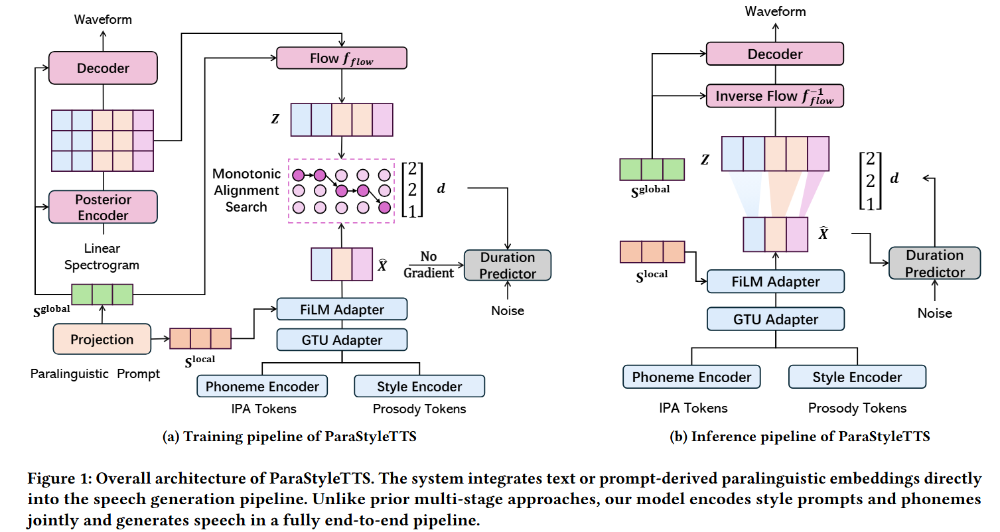

**Official Implementation for CIKM 2025 Paper**

This repository provides the official implementation of our CIKM 2025 paper:

**ParaStyleTTS: Toward Efficient and Robust Paralinguistic Style Control for Expressive Text-to-Speech Generation**

## 🧠 Overview

<p align="center">
  
</p>


## Abstract
Controlling speaking style in text-to-speech (TTS) systems has become a growing focus in both academia and industry. While many existing approaches rely on reference audio to guide style generation, such methods are often impractical due to privacy concerns and limited accessibility. More recently, large language models (LLMs) have been used to control speaking style through natural language prompts; however, their high computational cost, lack of interpretability, and sensitivity to prompt phrasing limit their applicability in real-time and resource-constrained environments. In this work, we propose ParaStyleTTS, a lightweight and interpretable TTS framework that enables expressive style control from text prompts alone. ParaStyleTTS features a novel two-level style adaptation architecture that separates prosodic and paralinguistic speech style modeling. It allows fine-grained and robust control over factors such as emotion, gender, and age. Unlike LLM-based methods, ParaStyleTTS maintains consistent style realization across varied prompt formulations and is well-suited for real-world applications, including on-device and low-resource deployment. Experimental results show that ParaStyleTTS generates high-quality speech with performance comparable to state-of-the-art LLM-based systems while being 30x faster, using 8x fewer parameters, and requiring 2.5x less CUDA memory. Moreover, ParaStyleTTS exhibits superior robustness and controllability over paralinguistic speaking styles, providing a practical and efficient solution for style-controllable text-to-speech generation. Demo can be found at https://parastyletts.github.io/ParaStyleTTS_Demo/.

## 🚀 How to Run ParaStyleTTS
The model weights are now hosted on Hugging Face [](https://huggingface.co/haoweilou/ParaStyleTTS). No longer need to manually download it from OneDrive anymore.

1. **Clone the repo**
    ```bash
    git clone https://github.com/haoweilou/ParaStyleTTS.git
    cd ParaStyleTTS
    pip install -r requirements.txt
    ```


<!-- 2. **Download the checkpoints**

   Download the pretrained checkpoints from the following link:  
   [Download Checkpoints (OneDrive)](https://unsw-my.sharepoint.com/:u:/g/personal/z5258575_ad_unsw_edu_au/EVu9cwOmIfJNmeMdI5R3ZtcBV0slBICNHUZBW7bYRy-ZzA?e=itFBau)

   Place the downloaded files inside the `ckp/` folder. -->

2. **Generate speech samples**

   Run the following command:

   ```bash
   python generate.py
   ```

The generated speech samples will be saved in the `sample/` folder.

You can modify both the text and the `style_prompt` as you wish.  
Currently, the model supports speaking style control over four dimensions:

- **Age:** child, teenager, young adult, adult  
- **Emotion:** angry, happy, sad, neutral, surprise  
- **Gender:** male, female  
- **Language:** English, Chinese  

You can specify the speaking style using natural language.  
For example:

```python
text = "hello world how are you"
style_prompt = ["A young female child speaking English with neutral emotion."]
```

Although the generated speech is primarily determined by the language of the input text,  
changing the `style_prompt` can still influence the **accent** and **prosody**. Which will produce speech with a **different accent**.

You can listen to ```mix_ch.wav``` and ```mix_en.wav``` samples to hear the difference between the two styles.

Enjoy experimenting and have fun! 🎧
